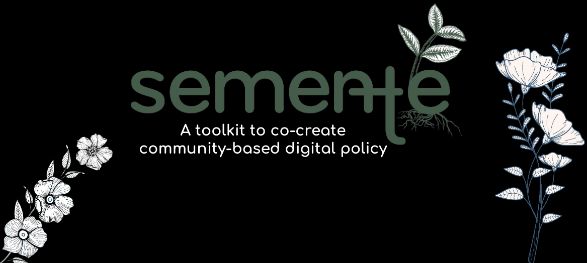
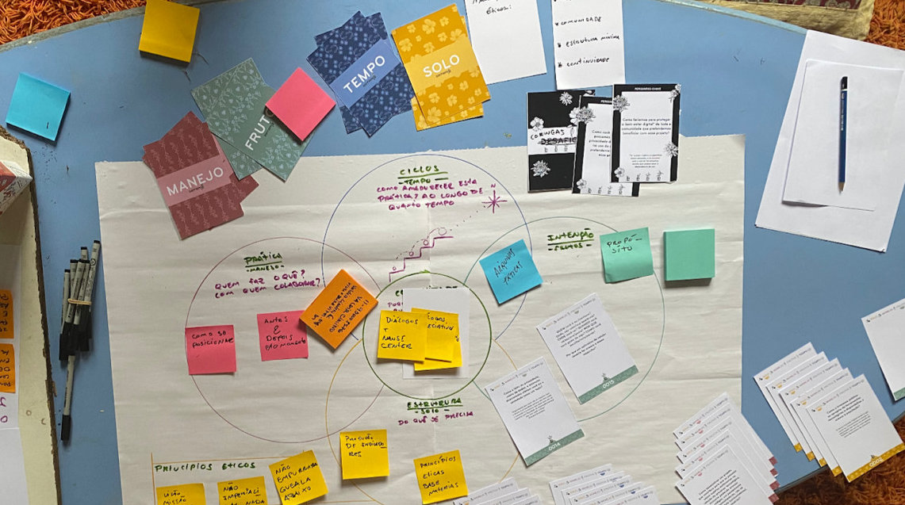
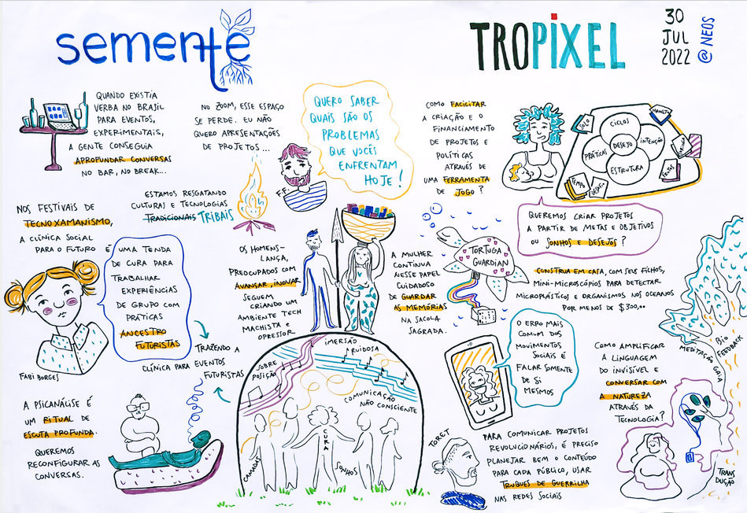

semente is a toolkit to for the co-creation of community-based initiatives. Its current prototype results from a collaboration between the Instituto Neos in Brazil and the University of Bristol.

  - **Subscribe [here](https://forms.gle/AoHdH7fD9VjxY6zf8)** to get updates about Semente.

  					semente builds on knowledge exchange in projects such as [fonte.wiki](https://fonte.wiki) and [ID21](https://fonte.wiki/id21). It is informed by decades of digital rights activism in Brazil and the intention to regenerate fair and inclusive futures with the critical appropriation of digital technologies.

            Semente had a series of feedback sessions during the 2022 edition of [Tropixel](https://tropixel.org) in Ubatuba, Brazil.

            					

            					The attached [slide presentation (PDF)](https://ia904701.us.archive.org/22/items/semente-23/semente_pub.pdf) presents a short overview of the process of building the first prototype of semente.
